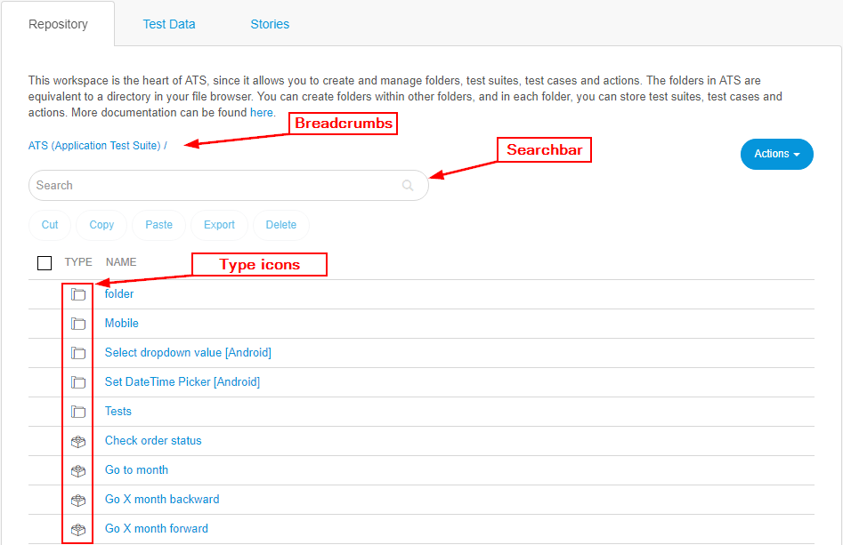

## 1 Introduction to the Repository

The Repository is the heart of ATS, it allows to create and manage folders, test suites, test cases, Drop-Downs, and actions. You can also create test data for data-driven testing. For more information on how to use data-driven testing in ATS, see [Test Data](test-data). You can access the repository by clicking Test Cases in the navigation menu.

You search for a specific item by using the search bar in the repository. ATS searches for the desired item in the current folder and all subfolders. So if you start searching ATS only searches inside your current folder and its subfolders.

The breadcrumbs in the repository allow quick navigation between folders. Click the name of the folder to go back to that parent folder.

With the type icons on the left side of the item name, you can identify at a glance the type of an item. The following table describes all type icons, used in the repository:

| Icon | Meaning |
| --- | --- |
|  | Folder |
| | Test case |
| | Test suite |
| | Action |

If you want to cut, copy or delete an item in the repository, you can do so by marking it with the checkbox. After that, the actions become available.

## Actions

In the repository you use the **Actions** drop-down to perform the following actions:

- Create a **New Folder**.
- Create a **New Test Case**. For more information on creating a test case, see [Test Case](test-case).
- Create a **New Test Suite**. For more information on creating a test suite, see [Test Suite](test-suite).
- Create a **New Action**. For more information on creating an action, see [Action](action).
- Create a **New Drop-Down**. For more information on creating a Drop-Down, see [Drop-Down](drop-down).
- **Import** items into the repository.

ATS stores all created items into the repository.

## Import/Export

ATS allows to export to and import data from an XML file. It is possible to move data between different apps or to save test definitions on your hard drive.

You can export the following data:

- Folders
- Test cases/test suites
- Actions
- Parameters set in actions/test cases

### Import

There are two ways of using the import: _create data_ and _update data_.

_Create data_ means that you import new data for the first time into your target project.

_Update data_ means that you overwrite existing data. This includes actions, test cases, test suites or folders.

When importing, ATS solves all conflicts by overwriting existing data with the imported ones.

To import data in ATS do the following:

- Click **Actions** and **Import**  to open the data import form.
- On the data import form, click **Import from file** to open the import data dialog box.

### Export

There are different scenarios on how to export data from ATS:

- Exporting a single action
- Exporting several actions
- Exporting test cases
- Exporting test suites
- Exporting folders containing:
  - Actions
  - Actions and test cases
  - Actions, test cases, and test suites
  - Folders, actions, test cases and test suites

To export the data, you have to mark the items in the **Repository** and then click **Export** in the top menu. You can also export the item right away from the edit view, by clicking **Export** in the top right.
