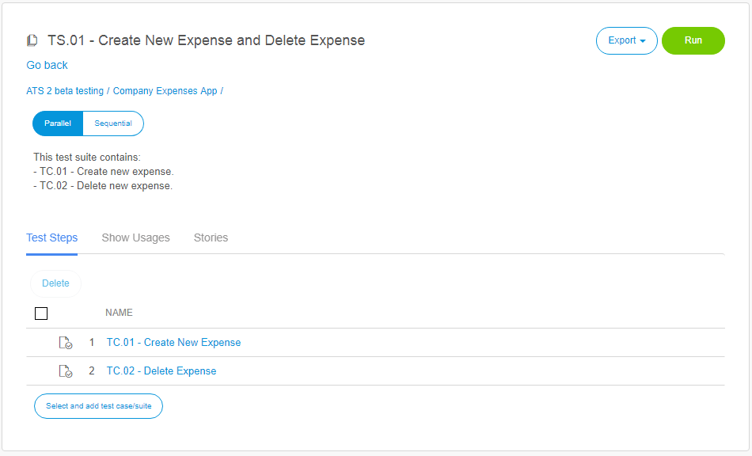
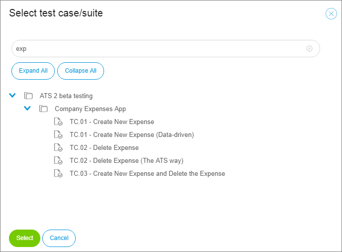

## Test Suite

A **test suite** is a set of test cases or other test suites. ATS uses test suites to execute a collection of test cases and/or suites in a sequence or parallel.

In ATS you create a new Test Suite by clicking New Test Suite in the **Actions** dropdown in the repository.
A dialog opens where you give your test suite a name and an optional description. After you created a new test suite, the **Test Suite Details** page opens.

## Test Suite Details

In the top left corner of the **Test Suite Details** page, you find the name and the description of the test case.  To change them, click them and edit the text. ATS saves the changes automatically.

With the **parallel/sequential switch**, you change the run behaviour of the test suite. If it is set to _parallel_, ATS tries to run all containing tests of your test suite in parallel. This is limited through the concurrency limit of your selenium hub. With the switch set to _sequential_, the tests run in succession.

In the top right corner of the page, you find the **Export** and **Run** buttons:

### Export

| Name                   | Description                              |
| ---------------------- | ---------------------------------------- |
| Export Test Definition | Creates an XML representation of your test suite, which you can import into another app. |

### Run

| Name                   | Description                              |
| ---------------------- | ---------------------------------------- |
| Run                    | The [run configuration page](test-run) opens, where you edit the run configuration. If the test suite was run before, the prior configuration is copied. |

### Test Steps

Under test steps you find all test cases and test suites that are used in the current test suite. You add new test case or test suite by searching for it in the **Add step** box.

For a more detailed search, you use the **Test Step Setup** dialog box by clicking . There you search for the desired test case or test suite in your project. You can also navigate through your project and explorer all available tests in it. 

You add a new step above or below an existing test step, by clicking **Add above** or **Add below**. The buttons appear when you hover your mouse over an existing test step.

#### Delete

To delete a test step in a test suite, click the  icon on the right side of the test step.
You can delete multiple test steps at once, by marking them with the checkbox and clicking **Delete**.

#### Drag & Drop

When you move your mouse over an existing test step, the drag and drop handle appears. By clicking and holding it you can move the test step to the new position.

### Show Usages

The Show Usages tab gives an overview of all the test cases and test suites used in your test suite. Besides that, it also shows other test suites the test suite is used by.

### Stories

Under Stories you add user stories to your test suite. This tab displays the connected stories, the number of test cases within that story and the success rate of the user story.

- Open story:  Opens the linked user story.
- Unlink selected story: This removes the link between test suite and user story.
- Link new story: Links an existing story to the test suite.
